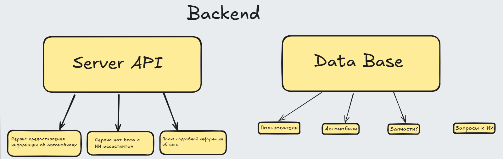

# Диплом
# Сайт для подбора автомобилей. ИИ сервис по подбору автомобилей

### Ссылка на интерактивную доску

https://excalidraw.com/#room=d8b23a7bcf3fa128c795,PljfauHK-T1nM-cUHRE0HQ

## Идея

    Включает в себя обширную базу автомобилей с их разнообразными характеристиками (от цены за новую машину до модели двигателя), а также сводку об их надежности (с чем чаще всего проблемы, как дорого чинить, есть ли сервисные центры, рекомендации по уходу).

    Рекомендации основанные в основном не на типичных фильтрах, а на: материальных доходах, потребностях, семейных обстоятельствах, свободное времяпрепровождение

## Функционал
#### Точно надо сделать
- Напоминание об обслуживании: чек КПП, замена масла, шин и тд.
- Рекомендации, для какой именно категории людей подходит конкретная машина, возможно это будет делать LLM (нейросеть).
- База автомобилей с карточками, где видны: цена (новая/на вторичке), основные характеристики, типичные неисправности, ориентировочные затраты на ТО/ремонт (годовые), рекомендации по уходу.
- Личный профиль пользователя
- Аутентификация через keyloack 
- APi Gateway

#### Можно добавить ещё
- Персонализованный «скрининг» при входе — короткий опросник (до 6 вопросов) о доходе, семье, стиле жизни, kilometrage/город/загород, бюджет — и быстрый рекомендованный топ-5.
- История надёжности/recall-ов и агрегированная статистика поломок для модели/двигателя/года выпуска (с простым UI «что ломается чаще всего»).
- Режим сравнения 3–4 машин с расчётом «итого за 5 лет» (TCO — total cost of ownership).
- VIN-декодер + интеграция с базами истории (пробег, аварии, страховые случаи) — полезно для приватных объявлений.
- Уведомления о падении/росте цен, отслеживание объявлений (watchlist).
- Сеть проверенных СТО и запись на обслуживание прямо из карточки авто.

AI функции
- Active-learning: попросить пользователя подтвердить, совпал ли прогноз (поломка/ремонт) → улучшение модели.
- LLM-ассистент «почему эта машина мне подойдёт» — объясняет подбор под конкретную персону (с аргументами: семья, доход, маршрут, ремонтопригодность). Использовать RAG (retrieval-augmented generation) — подтягивать факты из DB и источников, чтобы LLM не «галлюцинировал».
- Симулятор «как изменится TCO, если я …» (например: больше автодорог, меньше стоянки в гараже, другая марка шин).

Социальные функции
- Профили владельцев и «подходит ли для…» — например «подходит для молодой семьи с 2 детьми и дачной ездой».
- Отзывы владельцев по конкретным проблемам с моделями, агрегируемые по году/двигателю.
- Персональные чек-листы при покупке и осмотре б/у (шаблон для тест-драйва).

Самые интересные

- Интерактивный wizard «подбери мне машину для…» (виды сценариев: городская, дача, спорт, дальние поездки).

- Калькулятор TCO с интерактивным ползунком «сколько лет вы хотите владеть?».

- OCR/VIN-скан: сканируешь документы или VIN — получаешь историю.

- **Дальше еще надо добавить**
## Стек: 
    python, fastAp, postgres, redis, kafka, docker, keyclock, minio, возможно: neo4j

## Задачи

### Где и какие брать данные? 

Базу данных можно собрать либо платно, либо с парсинга дрома.

- Я нашел хорошие датасеты на гитхабе и kaggle, но их надо обработать и объединить.
- На крайний случай можно купить датасет или использовать демку от них же


### Как обучить нейронку?

Буду собирать промт и отправлять на LLM модель на основе gemini

### На какие микросервисы разделить?



#### **Backend**

##### Server API

**Базовый минимум:**
1. API Gateway
2. User Service
    * Профиль пользователя: доход, семья, стиль жизни, регион

    * Машины пользователя
    * Настройки напоминаний
    * Избранное
3. Car Catalog Service
    * предоставления краткой/подробной информации об авто
    * Search / Filter

    * Хранит:
        * Марки, модели, поколения
        * Двигатели, КПП
        * Характеристики
        * Фото (в MinIO)
        * Надёжность (хз)
        * Типовые проблемы (хз)
        * Интервалы ТО
4. Recommendation Service
    * сервис чат бота с ИИ ассистентом
5. Notification Service
    * Напоминания: ТО, страховка, сезонная замена шин
6. Auth Service (Keycloak)
7. VIN handler
с помощью сервиса https://www.auto.dev/pricing можно бесплатно парсить следующие данные:
- VIN Decode
- Vehicle Listings
- Vehicle Photos

Price: Бесплатно на 1000 запросов в месяц

**Можно добавить:**

8) Pricing Service
    * Рыночные цены:новая, вторичка
    * Статистика по рынку
    * История изменения цен
9) TCO Service
    * ```TCO = fuel + maintenance + repairs + insurance + depreciation```
10) Parser Service

##### Data Base
недоделано:
1. Postgres
2. Redis
3. Neo4j
4. Minio
5. 

#### **Frontend**

##### Node js site
Сделал макет через Figma Make


## Roadmap-предложение

1 этап (MVP): БД + UI карточек машин + базовые фильтры + напоминания по ТО + простой content-based recommender + персональные профили.

2 этап: Рыночные цены, TCO калькулятор, интеграцию с СТО, LLM для объяснений (RAG), push.
